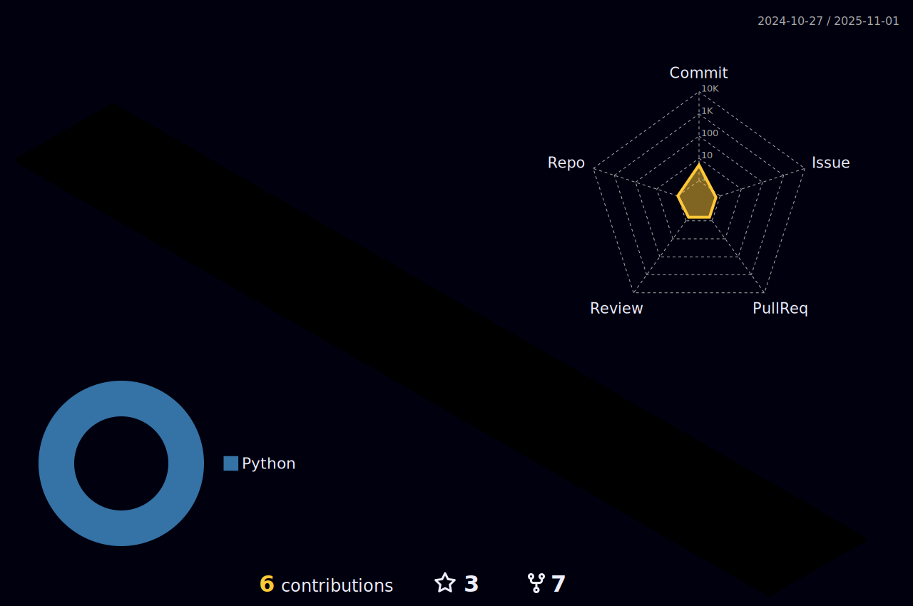

My passion for technology, nature and physics drives me to bridge the gap between growing web technologies and end-users, making them accessible and easy to use. By integrating elements of physics and the natural world into my work, I create digital experiences that blend the beauty of nature, the complexity of physics, and the power of code.  Let's collaborate and build something amazing together!

###

 

###

<h3 align="left">Language and tools :</h3>

  
  
  
  
  
  
  
  
  
  
  
  
  
  
  
  
  
  
  
  
  
  
  
  
  
  
  
  
  
  
  
  
  
  
  
  
  
  
  

 

<h3 align="left">Github :</h3>

  
  

<h3 align="left">Github Contributions / Leetcode Statistics :</h3>

  
  

 

<h3 align="left">Holopin :</h3>

  

 

  

    <h3 align="left">3D Commit Graph :</h3>
  

  

    
  

  

  

    <h3 align="left">Others :</h3>
  

  

    
  

<h3 align="left">Social :</h3>

  
  

